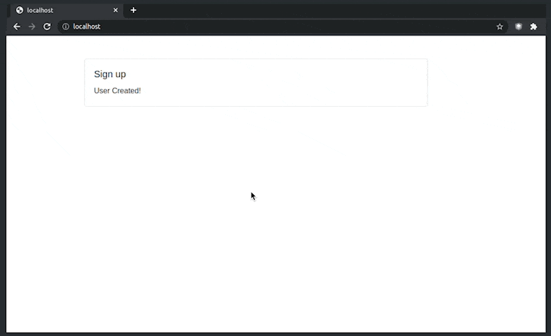

The project implements a simple registration form comprising 4 fields (name, email, password and password confirmation). The starter HTML is available here: `public/index.html`.

## Demo



The form is of controlled type. While being filled out, the form validates all the fields, using the [yup](https://github.com/jquense/yup#usage) library.

The submit button is disabled by default. It becomes available when the whole form is valid. It becomes disabled again if any of the fields becomes invalid.

## An example of HTML with an invalid email and password

```html
<div data-container="sign-up">
  <form data-form="sign-up" method="post">
    <div class="form-group">
      <label for="sign-up-name">Name</label>
      <input id="sign-up-name" type="text" class="form-control" name="name">
    </div>
    <div class="form-group">
      <label for="sign-up-email">Email<sup>*</sup></label>
      <!-- Если поле невалидно, то добавляется класс is-invalid -->
      <input id="sign-up-email" required="" type="email" class="form-control is-invalid" name="email">
      <div class="invalid-feedback">Value is not a valid email</div>
    </div>
    <div class="form-group">
      <label for="sign-up-password">Password<sup>*</sup></label>
      <input id="sign-up-password" required="" type="password" class="form-control is-invalid" name="password">
      <div class="invalid-feedback">Must be at least 6 letters</div>
    </div>
    <div class="form-group">
      <label for="sign-up-password-confirmation">Password Confirmation<sup>*</sup></label>
      <input id="sign-up-password-confirmation" required="" type="password" class="form-control" name="passwordConfirmation">
    </div>
    <input type="submit" class="btn btn-primary" value="Submit" disabled>
  </form>
</div>
```

When the form is valid, it's submitted to the `/users` endpoint. The submit button is disabled while the form is being processed to avoid a repeat submission of the same data.

When the form has been submitted, it's replaced with the following html.

```html
<div data-container="sign-up">User Created!</div>
```